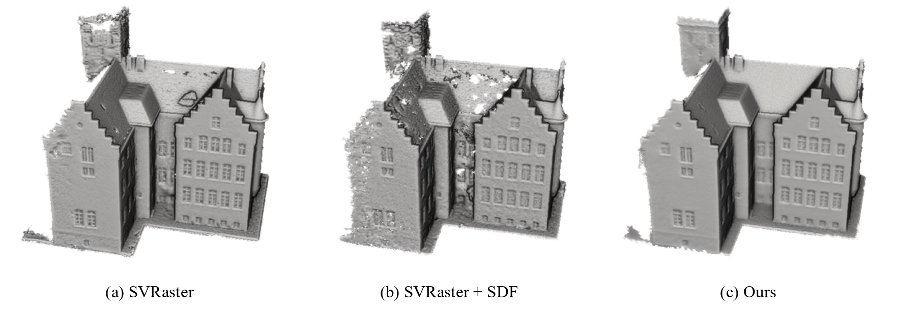

# SVRecon: Sparse Voxel Rasterization for Surface Reconstruction



### [Project page](https://jaesung-choe.github.io/svrecon/index.html) | [Arxiv](https://arxiv.org/abs/2511.17364) 

<details>
<summary>Paper abstract</summary>
We extend the recently proposed sparse voxel rasterization paradigm to the task of high-fidelity surface reconstruction by integrating Signed Distance Function (SDF), named SVRecon. Unlike 3D Gaussians, sparse voxels are spatially disentangled from their neighbors and have sharp boundaries, which makes them prone to local minima during optimization. Although SDF values provide a naturally smooth and continuous geometric field, preserving this smoothness across independently parameterized sparse voxels is nontrivial. To address this challenge, we promote coherent and smooth voxel-wise structure through (1) robust geometric initialization using a visual geometry model and (2) a spatial smoothness loss that enforces coherent relationships across parent-child and sibling voxel groups. Extensive experiments across various benchmarks show that our method achieves strong reconstruction accuracy while having consistently speedy convergence.
</details>

**Updates:**
- This project is under active development and not ready for stable use yet. We will update instructions and benchmarks soon.

## Install
### 1) Clone this repository (with PI3 submodule)
```bash
git clone --recursive https://github.com/alvin0808/SVRecon.git
cd SVRecon

# If you already cloned without --recursive:
git submodule update --init --recursive
```
### 2) Create conda environment
```bash
conda create -n svrecon python=3.10 -y
conda activate svrecon
```
### 3) Install PyTorch (tested: 2.5.0 + CUDA 12.4)
```bash
pip install torch==2.5.0 torchvision==0.20.0 \
  --index-url https://download.pytorch.org/whl/cu124
```
### 4) (Optional) Install CUDA toolkit inside the conda env

May need to install cuda-toolkit for your virtual environment that is aligned with the installed pytorch:
```bash
conda install -y -c "nvidia/label/cuda-12.4.0" cuda-toolkit
```
### 5) Install Python dependencies (includes PI3 deps)
```bash
pip install -r requirements.txt
```

### 6) Build and install sparse voxel CUDA rasterizer

If the build process cannot find torch due to build isolation, use --no-build-isolation.
```bash
pip install -e cuda/ --no-build-isolation
```


## Reconstructing your own capture
Below go through the workflow for reconstruction from a scene capturing. 


### Data preparation
We recommend to follow [InstantNGP](https://github.com/NVlabs/instant-ngp/blob/master/docs/nerf_dataset_tips.md#colmap) video or images processing steps to extract camera parameters using COLMAP. [NerfStudio](https://docs.nerf.studio/quickstart/custom_dataset.html) also works.

We now only support pinhole camera mode. Please preprocess with `--colmap_camera_model PINHOLE` of InstantNGP script or `--camera-type pinhole` of NerfStudio script.

### Pi3 initialization 

Before training, you can optionally run Pi3 to generate an initial aligned point cloud from your COLMAP reconstruction.

#### Common arguments

- `--data_root`  
  Path to the image folder used by Pi3. The folder should contain your input RGB images.

- `--model`  
  Path to Pi3 weights, e.g. `model.safetensors`.

- `--out_dir`  
  Output directory for intermediate Pi3 exports, including:
  - `camera_poses_{i}.pt` (poses per split)
  - `point_cloud_final_sor_filtered_{i}.ply` (point clouds per split)

- `--out_ply`  
  Output path for the final merged aligned point cloud (`.ply`).

- `--interval`  
  Split factor for long sequences (useful when you have many images, e.g. >50).  
  Pi3 will export results multiple times with different starting offsets:
  - `i = 0, 1, ..., interval-1`
  - each split uses frames: `i, i+interval, i+2*interval, ...`  
  Larger `interval` reduces per-run memory/time and makes the pipeline more robust on long sequences.

- `--sample_rate`  
  Random keep ratio for the final merged `.ply`.  
  Example: `--sample_rate 0.5` keeps ~50% of the aligned points (useful to reduce file size).

---
#### Run Pi3 export + COLMAP pose alignment (one command)

```bash
python scripts/pi3/run_export_and_align_colmap.py \
  --data_root /path/to/your_dataset/images \
  --model /path/to/model.safetensors \
  --out_dir output/pi3_export_colmap \
  --gt_bin /path/to/your_dataset/sparse/0/images.bin \
  --out_ply /path/to/your_dataset/sparse/0/aligned_points3D.ply \
  --interval 2 \
  --conf_th 0.05 \
  --sample_rate 0.5
```
#### COLMAP format requirements

Your dataset directory result should look like:
```text
your_dataset/
├── images/                 # input images
├── conf/                   # confidence outputs
├── normal/                 # normal outputs
└── sparse/
    └── 0/
        ├── images.bin      # COLMAP registered images (extrinsics)
        ├── cameras.bin
        └── aligned_points3D.ply   # final aligned point cloud (generated)
```

- --gt_bin must point to sparse/0/images.bin.
#### Run Pi3 export + Nerf pose alignment (one command)
````bash
python scripts/pi3/run_export_and_align_nerf.py \
  --data_root /path/to/your_nerf_dataset/image \
  --gt_json /path/to/your_nerf_dataset/transforms_train.json \
  --model /path/to/model.safetensors \
  --out_dir output/pi3_export_nerf \
  --out_ply /path/to/your_nerf_dataset/aligned_points3D.ply \
  --interval 1 \
  --sample_rate 0.5
````
#### NeRF (transforms_*.json) format requirements

Your dataset directory result should look like:
```text
your_nerf_dataset/
├── image/                 # input images
├── conf/                   # confidence outputs
├── normal/                 # normal outputs
├── transforms_train.json   # GT poses (OpenGL c2w)
├── transforms_test.json    # (optional)
└── aligned_points3D.ply    # final aligned point cloud (generated)
```
### Scene optimization
```bash
python train.py --eval --source_path $DATA_PATH --model_path $OUTPUT_PATH
```
All the results will be saved into the specified `$OUTPUT_PATH` including the following results:
- `config.yaml`: The config file for reproduction.
- `pg_view/`: Visualization of the training progress. Useful for debugging.
- `test_stat/`: Some statistic during the training.
- `test_view/`: Some visualization during the training.

The configuration is defined by the following three, the later overwrites the former.
- `src/config.py`: Define the configuable setup and their initial values.
- `--cfg_files`: Sepcify a list of config files, the later overwrites the former. Some examples are under `cfg/`.
- command line: Any field defined in `src/config.py` can be overwritten through command line. For instances: `--data_device cpu`, `--subdivide_save_gpu`.

Like InstantNGP and other NeRF variants, defining a proper main scene bounding box is crucial to quality and processing time. Note that the main scene bound is defined for the main 3D region of interest. There are another `--outside_level` (default 5) Octree levels for the background region. The default main scene bound heuristic may work well in many cases but you can manually tweak them for a better results or covering new type of capturing trajectory:
- `--bound_mode`:
    - `default`
        - Use the suggested bbox if given by dataset. Otherwise, it automatically chose from `forward` or `camera_median` modes.
    - `camera_median`
        - Set camera centroid as world origin. The bbox radius is set to the median distance between origin and cameras.
    - `camera_max`
        - Set camera centroid as world origin. The bbox radius is set to the maximum distance between origin and cameras.
    - `forward`
        - Assume [LLFF](https://github.com/Fyusion/LLFF?tab=readme-ov-file#local-light-field-fusion) forward-facing capturing. See `src/utils/bounding_utils.py` for detail heuristic.
    - `pcd`
        - Use COLMAP sparse points to compute a scene bound. See `src/utils/bounding_utils.py` for detail heuristic.
- `--bound_scale`: scaling the main scene bound (default 1).

For scenes with background masked out, use `--white_background` or `--black_background` to specify the background color.

Other hyperparameter suggestions:
- Ray termination
    - `--lambda_T_inside 0.01` to encourage rays to stop inside the Octree. Useful for real-world scenes.
    - `--lambda_T_concen 0.1` to encourage transmittance to be either 0 or 1. Useful for scenes whose background pixels are set to white or black. Remember to set either `--white_background` or `--black_background` in this case.
- Geometry
    - `--lambda_normal_dmean 0.001 --lambda_normal_dmed 0.001` to encourage self-consistency between rendered depth and normal.
        - Also cite [2dgs](https://arxiv.org/abs/2403.17888) if you use this in your research.
    - `--lambda_ascending 0.01` to encourage density to be increasing along ray direction.
    - `--lambda_sparse_depth 0.01` to use COLMAP sparse points loss to guide rendered depth.
        - Also cite [dsnerf](https://arxiv.org/abs/2107.02791) if you use this in your research.
    - `--lambda_depthanythingv2 0.1` to use depthanythingv2 loss to guide rendered depth.
        - It uses the huggingface version.
        - It automatically saves the estimated depth map at the first time you activate this loss for the scene.
        - Also cite [depthanythingv2](https://arxiv.org/abs/2406.09414) and [midas](https://arxiv.org/abs/1907.01341) if you use this in your research.
    - `--lambda_mast3r_metric_depth 0.1` to use the metric depth derived from MASt3R to guide the rendered depth.
        - You need to clone MASt3R and install all its dependency.
        - You also need to set `--mast3r_repo_path {abs_path_to_mast3r_repo}`.
        - It automatically saves the estimated depth map at the first time you activate this loss for the scene.
        - Also cite [MASt3R](https://arxiv.org/abs/2406.09756) and [DUSt3R](https://arxiv.org/abs/2312.14132) if you use this in your research.
- `--save_quantized` to apply 8 bits quantization to the saved checkpoints. It typically reduce ~70% model size with minor quality difference.

### Measuring FPS
```bash
python render.py $OUTPUT_PATH --eval_fps
```

### Rendering views
- Rendering full training views:
    - `python render.py $OUTPUT_PATH --skip_test --rgb_only --use_jpg`
- Rendering testing views and evaluating results:
    - It only works when training with `--eval`.
    - `python render.py $OUTPUT_PATH --skip_train`
    - `python eval.py $OUTPUT_PATH`
- Render fly-through video:
    - `python render_fly_through.py $OUTPUT_PATH`


### Meshing
Remember to train with `--lambda_normal_dmean 0.001 --lambda_normal_dmed 0.001` to get a better geometry. Using sparse depth from COLMAP may also help `--lambda_sparse_depth 0.01`. After the scene optimization completed, run:
```bash
python extract_mesh.py $OUTPUT_PATH
```


## Experiments on public dataset

**Note:** Be sure to double check the following two experimental details which has non-trivial impact to the quantitative results.
- Ground-truth downsampling: Results from (1) the internal downsampling `--res_downscale` and (2) the preprocessed down-sampled images specified by `--images` are very different. We follow the original 3DGS to use `--images`.
- LPIPS input scale: We follow the original 3DGS to use RGB in range of [0, 1] as default. The correct implementation should be in [-1, 1] which is reported as the corrected LPIPS by `eval.py`.

### Download the 3rd-party processed datasets
- Novel-view synthesis
    - [Mip-NeRF360 dataset](https://jonbarron.info/mipnerf360/)
    - [T&T and DeepBlending dataset](https://github.com/graphdeco-inria/gaussian-splatting#running)
    - [Synthetic NeRF dataset](https://www.matthewtancik.com/nerf/)
    - [Scannet++ dataset](https://kaldir.vc.in.tum.de/scannetpp/)
        - Check [scripts/scannetpp_preproc.py](./scripts/scannetpp_preproc.py) for pre-processing.
- Mesh reconstruction
    - [DTU dataset](https://github.com/Totoro97/NeuS)
        - Check [scripts/dtu_preproc.py](./scripts/dtu_preproc.py) for pre-processing.
    - [Tanks&Temples dataset](https://github.com/hbb1/2d-gaussian-splatting)

### Running base setup
```bash
exp_dir="baseline"
other_cmd_args=""

# Run training
./scripts/mipnerf360_run.sh     output/mipnerf360/baseline     $other_cmd_args
./scripts/synthetic_nerf_run.sh output/synthetic_nerf/baseline $other_cmd_args
./scripts/tandt_db_run.sh       output/tandt_db/baseline       $other_cmd_args
./scripts/dtu_run.sh            output/dtu/baseline            $other_cmd_args
./scripts/tnt_run.sh            output/tnt/baseline            $other_cmd_args

# Summarize results
python scripts/mipnerf360_stat.py     output/mipnerf360/baseline
python scripts/synthetic_nerf_stat.py output/synthetic_nerf/baseline
python scripts/tandt_db_stat.py       output/tandt_db/baseline
python scripts/dtu_stat.py            output/dtu/baseline
python scripts/tnt_stat.py            output/tnt/baseline
```


## Acknowledgement
Our method is developed on the amazing open-source codebase: [SVRaster](https://github.com/NVlabs/svraster), [gaussian-splatting](https://github.com/graphdeco-inria/gaussian-splatting) and [diff-gaussian-rasterization](https://github.com/graphdeco-inria/diff-gaussian-rasterization).

If you find our work useful in your research, please be so kind to give us a star and citing our paper.
```bibTeX
@article{oh2025svrecon,
  title={SVRecon: Sparse Voxel Rasterization for Surface Reconstruction},
  author={Oh, Seunghun and Choe, Jaesung and Lee, Dongjae and Lee, Daeun and Jeong, Seunghoon and Wang, Yu-Chiang Frank and Park, Jaesik},
  journal={arXiv preprint arXiv:2511.17364},
  year={2025}
}
```
